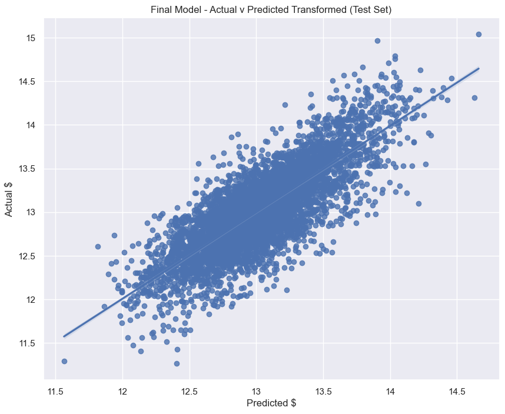
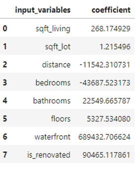

# House Valuation Tool for Home Buyers and Sellers

**Author**: [Ruthy Yao](mailto:zejia.yao@gmail.com)

## Overview

The online real estate platform HomeConnect is looking to develop new functions and tools for its residential website so they can enhance the website user experience and increase the traffic. One idea is to create a housing valuation tool that allow users to self evaluate the houses they plan to buy or sell before they actually go to the market. They decided to use King County's property dataset to build a model as a trial. If the trial is successful, they will consider release it officially on the website. 

## Business Problem
HomeConnect's senior leadership team (SLT) highlighted three important things to consider for this house valuation model.  

* Reliability - The predicated house price from the model should explain as much as possible the variance with the actual sold price and minimize the prediction error. 
* Practicability - Users can easily input some housing price variables to work out the house value, i.e. the model shouldn't require the users to do any research in order to find out the value of the input.
* Insights - we should draw some insights from the model around what the high correlated features are with the house price so we can provide some value-add advices to the potentail home buyers and sellers.

The SLT doesn't quantify the model evaluation measurements. Hence, our data analytics team decide to use some external beachmark. Sepcifically, for "Reliability", we decide to use the adjusted R-squared - we aim for the model to have an adjusted R-squared of at least 60%. For the prediction error, we decided to use root mean square error(RMSE). Based on the our research, we think an RSME of \\$200k - \\$300k will be regarded as a good prediction.  Finally, For "Practicability", intuitively we think basic building parameters such as the property size, the number of bedrooms, etc should be the input variables. We will investigate the dataset to better define the input variables for the model. 

## Data and Methods

The predictive model is derived from King County's property dataset which contains over 21k piece of data for houses sold between 2014 and 2015. The dataset provides the house selling price and a wide variety of characteristics, including the basic building features such as the land size, living area size, basement size, the number of bedrooms and bathrooms, etc. It also provides the location features - longitude, latitude and zipcode. Finally, the house condition and grade for construction quality are also in the dataset.  

The project used multilinear regression modelling to create a house valuation tool. The model is refined and evaluated through 4 iterations. In the iteration process, it applied train-test split to validate the model and used the "adjusted R-Squared" to evaluate the goodness of fit. To achieve the best fit for the prediction model, it uses the recursive feature elimination method to determine the optimal number of features. Finally, to accomodate reliability yet being practical, the model finds the trade-off between prediction accuracy and simplicity for users.  

## Results and Insights

The final model selected 9 variables across the construction and the location parameters, which explains 65% of the housing price with a prediction error of $185k.



The model also identified the the most correlated factors with the house price. 




Some key inisghts are:

* Waterfront houses can substaintially drive the house price up.
* Renovation can increase the house value.
* House price is more correlated with the size of the living area than the land size.
 

### Nest Steps
Additional dataset and further analysis will enhance the prediction of this tool and prepare it to be launched officially on HoneConnect's property website.

- **Categorize the houses into metro, regional and rural** - Houses in different regions display distinctive features. Adding a region parameter will help refine the model and reduce the prediction error.

- **Bring in the national geospatial data to the model** - Incorporate a geospatial dataset of the whole country which is a stepping stone for the tool to be officially published on the website.  

- **Incorporate condos or apartment housing data** - - Adding different housing types will enrich the data and enhance the usability of the tool.

## For More Information

See the full analysis in the [Jupyter Notebook](./house_price_prediction_tool.ipynb) or review this [presentation](./house_price_prediction_tool_presentation.pdf).

For additional info, contact Ruthy Yao at [zejia.yao@gmail.com](mailto:zejia.yao@gmail.com)

## Repository Structure

```
├── Data
│   ├── kc_hosue_data.csv
│   └── column_names.md
├── images
├── hosue_price_prediction_tool.ipynb 
├── hosue_price_prediction_tool_presentation.pdf
└── README.md
```
# House_valuation_tool
